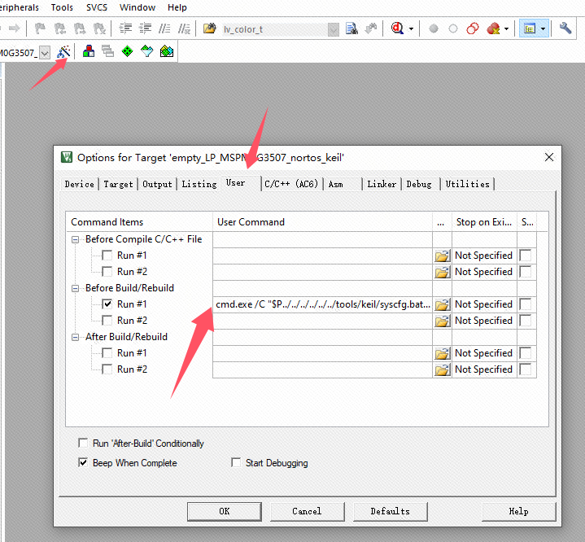
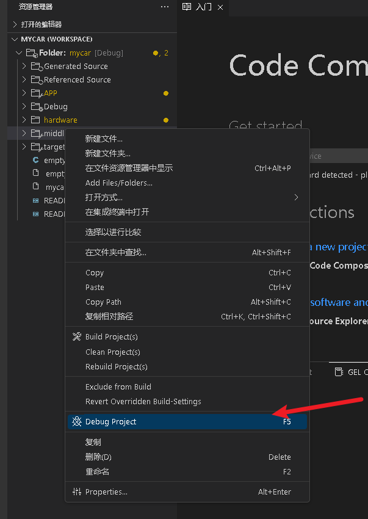

# 两种方式，keil开发和CCS开发

先说两种方式的优点缺点

keil开发：环境配置有点麻烦，有时候sysconfig生成的文件不会自动覆盖(如遇该问题，看问题汇总), 优点是一直都在用，熟悉。

ccs开发：环境配置非常非常非常简单，但是烧录仅支持jlink和xds。优点是基于vscode开源代码编写。还有就是ccs 的仿真(debug)对于jlink来说有问题，只能运行大概20-60秒，对于烧录没有问题，网上的答案是专门为了xds服务的。

所以各有千秋.........

不过强烈建议CCS。不然你会在keil遇到一堆问题，包括但不限于，在main中增加或者注释一行代码就烧录不了，中断各种进不去，每次更新sysconfig都要复制粘贴一份ti_msp_dl_config.c.h。。。。。。

贴一下官网下载链接：

[MDK-ARM Version 5.42a Evaluation Software Request](https://www.keil.com/demo/eval/arm.htm)

[MSPM0-SDK 软件开发套件 (SDK) | 德州仪器 TI.com.cn](https://www.ti.com.cn/tool/cn/MSPM0-SDK?keyMatch=MSPM0-SDK)

[SYSCONFIG IDE, configuration, compiler or debugger | TI.com](https://www.ti.com/tool/SYSCONFIG)

[Arm Keil | Texas Instruments MSPM0G1X0X_G3X0X_DFP](https://www.keil.arm.com/packs/mspm0g1x0x_g3x0x_dfp-texasinstruments/boards/)

[CCSTUDIO IDE、配置、编译器或调试器 | 德州仪器 TI.com.cn](https://www.ti.com.cn/tool/cn/CCSTUDIO?keyMatch=CCS&tisearch=search-everything#downloads)

我提供的百度网盘里都有

通过网盘分享的文件：ti资源包.zip
链接: https://pan.baidu.com/s/1PC0C6UNo9Z-RHu_L7bsaBQ?pwd=njw8 提取码: njw8 
--来自百度网盘超级会员v4的分享

## keil开发

下载资源包里的 sysconfig、 m0_sdk、MSPM0 DFP 。记住SYSCONFIG和M0_SDK安装路径，建议创建一个文件夹TI存放，后面要用到。


等待全部安装完成后。导航至 SDK 文件夹中的 <SDK路径下>/tools/keil/，然后用记事本打开 syscfg.bat 进行编辑，不要双击运行。


修改该文件的以下内容为你安装的sysconfig的路径下的sysconfig_cli.bat

原本：


修改为：


修改完成后保存。

然后用记事本打开同一目录下的MSPM0_SDK_syscfg_menu_import.cfg。不要双击运行


修改该文件的以下内容：


将其修改为你sysconfig路径下的，如果使用我的资源包，应该修改成以下内容：

```
[Sysconfig v1.24.0 - MSPM0 SDK v2_05_00_05]
Command=你安装的盘符:\TI\SYSCONFIG\nw\nw.exe 你安装的盘符:\TI\SYSCONFIG
Initial Folder=你安装的盘符:\TI\M0_SDK\mspm0_sdk_2_05_00_05
```


修改完成后保存。打开keil,打开Tools\customize Tools Menu.


然后新建，导入。。如果没有右边的这个框，请安装资源包里的MDK539.exe。原因是版本太低。


选择mspm0_sdk路径下的MSPM0_SDK_syscfg_menu_import.cfg。


导入完成会出现下面框选的内容：


然后点击tools下的sysconfig，就能进行开发了。但是请注意，此工具只能在你在keil选中该  文件名.syscfg    才能打开，不然会出现下图所示：


所以要查看是否配置成功需打开历程，历程位于

你的安装盘符:\TI\M0_SDK\mspm0_sdk_2_05_00_05\examples\nortos\LP_MSPM0G3507\driverlib\empty\keil


然后选中empty.syscfg打开，随后打开sysconfig就能正常启动。记住，必须是得界面处于empty.syscfg下才能打开


然后点击GPIO，如果是下图，那就说明m0sdk版本和sysconfig版本不匹配，正常使用我的资源包没有该问题。


这算是完成了第一步，因为你要打开sysconfig就必须得有.syscfg文件，所以你还需要移植上面的那个空白empty项目

复制刚才的empty工程，注意你的型号，在sdk里的例子里选择对应的型号

将SDK路径下的G3507空白工程复制到SDK的根目录下：


在Keil中打开我们复制的空白工程 empty


设置图形化配置文件保存路径：



原来：

```
cmd.exe /C "$P../../../../../../tools/keil/syscfg.bat '$P' empty.syscfg"
```

改成：

```
cmd.exe /C "$P../../tools/keil/syscfg.bat '$P' empty.syscfg"
```

然后设置工程头文件路径:


改为：


设置工程链接器：


改为：

```
../../source/ti/driverlib/lib/keil/m0p/mspm0g1x0x_g3x0x/driverlib.a
```

接下来就可以正常使用了。


这就是keil开发环境配置，下面来讲ccs，ccs配置超级简单，不用设置那么多，一键傻瓜式操作，自动生成。

## CCS开发

资源包里有两个版本的，ccs20和ccs theia 1.5。都可以使用。


等待ccs安装完成

代开后按下shift+ctrl+P,输入language，选中Configure Display Language可以配置语言。


然后新建工程


输入M0G3507


选择以下参数后点击create。


然后如果你没有安装m0-sdk和sysconfig，那么恭喜你，可以傻瓜式操作，直接点击。安装过的话请转到手动配置。

### 在线安装（自动配置）


等待安装完成


import即可。


### 已经下载过后手动配置


即可。


怎么烧录？这样就行：


选择你的烧录器。


接下来build,然后debug，点击运行即可

