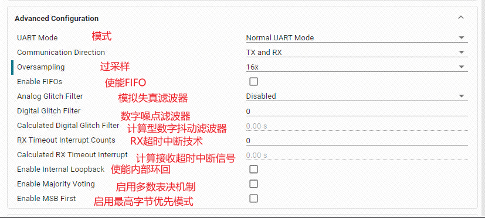

前缀基本上都为DL_

先讲一下TI的时钟：

**BUSCLK**：由内部高频振荡器提供的CPU时钟，通常芯片默认设置为了32MHz。

**MFCLK**：只能使用固定的4MHz时钟(参考用户手册132页)。开启的话需要配置时钟树的SYSOSC_4M分支，才能够正常开启。

**LFCLK**：由内部的低频振荡器提供时钟（32KHz）。在运行、睡眠、停止和待机模式下有效，使用该时钟可以实现更低的功耗。

如果不清楚细节可以看看[【立创·天猛星MSPM0G3507开发板】介绍 | 立创开发板技术文档中心](https://wiki.lckfb.com/zh-hans/tmx-mspm0g3507/)，关于TI的他是最详细的了。

需要注意的是配置完成后记得看PinMux的引脚对不对，有时需要手动修改。

[TOC]

# 一、延时

## 延时函数

CPUCLK_FREQ为主频频率，一般在ti_msp_dl_config.h里已经定义，默认32M

delay_cycles为系统函数，CPUCLK_FREQ为系统默认主频宏定义

延时一秒：

```
delay_cycles(主频hz)
```

延时1ms：

```
delay_cycles(CPUCLK_FREQ/1000);
```

延时1us：

```
delay_cycles(CPUCLK_FREQ/1000000);
```

因此，可以封装为(也可以宏定义)：

```
void delay_ms(unsigned int ms)
{
  delay_cycles( (CPUCLK_FREQ/1000) * (ms) );
}

void delay_us(unsigned int us)
{
  delay_cycles( (CPUCLK_FREQ/1000000) * (us) );
}
```

还有一种为系统滴答定时器，需开启SYSTICK

```
void SysTick_Handler(void)
{
    uwTick++;
}
```

方框内需是1ms.若为1us，SysTick_Handler每1us触发一次。


## 更改系统主频MCLK


然后打开时钟树


配置SYSPLL


# 二、GPIO控制

****

## 该函数为控制引脚输出高电平：

```
void DL_GPIO_setPins(GPIO_Regs* gpio, uint32_t pins)
```

说明：

该函数用于将指定的GPIO端口的某些引脚设置为高电平（输出1）。

- gpio：GPIO端口的寄存器指针（如GPIOA、GPIOB等）。

- pins：需要设置为高电平的引脚位掩码（如DL_GPIO_PIN_0 | DL_GPIO_PIN_1）。

## 该函数为控制引脚输出低电平：

```
void DL_GPIO_clearPins(GPIO_Regs* gpio, uint32_t pins)
```

说明：

该函数用于将指定的GPIO端口的某些引脚设置为低电平（输出0）。

- gpio：GPIO端口的寄存器指针。

- pins：需要设置为低电平的引脚位掩码。

## 该函数为控制引脚的电平翻转：

```
void DL_GPIO_togglePins(GPIO_Regs* gpio, uint32_t pins)
```

说明：

该函数用于将指定的GPIO引脚电平进行翻转（高变低，低变高）。

- gpio：GPIO端口的寄存器指针。

- pins：需要翻转的引脚位掩码。

## 读取引脚的状态：

```
uint32_t DL_GPIO_readPins(GPIO_Regs* gpio, uint32_t pins)
```

说明：

该函数用于读取指定GPIO端口所有引脚的当前电平状态。

- gpio：GPIO端口的寄存器指针。

- 返回值：每一位代表一个引脚的电平状态（1为高，0为低）。

## 配置引脚为输入/输出

正常初始化就已经设置，一般用不到

```
void DL_GPIO_init(GPIO_Regs* gpio, uint32_t pins, DL_GPIO_DIR direction)
```

说明：

该函数用于初始化GPIO引脚的方向（输入或输出）。

- gpio：GPIO端口的寄存器指针。

- pins：需要配置的引脚位掩码。

- direction：引脚方向（如DL_GPIO_DIR_INPUT或DL_GPIO_DIR_OUTPUT）。

# 三、I2C读写

## I2C发送数据（写）

```
void DL_I2C_transmitData(I2C_Regs* i2c, uint8_t data)
```

说明：

该函数用于通过I2C总线发送一个字节数据。

- i2c：I2C外设的寄存器指针（如I2C0、I2C1等）。

- data：要发送的8位数据。

## I2C接收数据（读）

```
uint8_t DL_I2C_receiveData(I2C_Regs* i2c)
```

说明：

该函数用于从I2C总线接收一个字节数据。

- i2c：I2C外设的寄存器指针。

- 返回值：接收到的8位数据。

## I2C发送起始信号

```
void DL_I2C_generateStart(I2C_Regs* i2c)
```

说明：

该函数用于产生I2C起始信号，开始一次I2C通信。

- i2c：I2C外设的寄存器指针。

## I2C发送停止信号

```
void DL_I2C_generateStop(I2C_Regs* i2c)
```

说明：

该函数用于产生I2C停止信号，结束一次I2C通信。

- i2c：I2C外设的寄存器指针。

## I2C检查总线忙状态

```
bool DL_I2C_isBusBusy(I2C_Regs* i2c)
```

说明：

该函数用于检测I2C总线是否处于忙状态。

- i2c：I2C外设的寄存器指针。

- 返回值：true表示总线忙，false表示空闲。

## I2C设置从设备地址

```
void DL_I2C_setTargetAddress(I2C_Regs* i2c, uint8_t address)
```

说明：

该函数用于设置I2C通信的目标从设备地址。

- i2c：I2C外设的寄存器指针。

- address：7位从设备地址。

## example

```
void IRI2C_WriteByte(uint8_t addr, uint8_t dat) {
    uint8_t temp[2];
    temp[0] = addr; // 第1步：temp[0]存放要写入的寄存器地址
    temp[1] = dat;  // 第2步：temp[1]存放要写入的数据

    // 第3步：将要发送的数据写入I2C控制器的发送FIFO（一次写入2字节：寄存器地址+数据）
    DL_I2C_fillControllerTXFIFO(I2C_0_INST, temp, 2);

    // 第4步：等待I2C控制器空闲，确保FIFO数据已准备好
    while (!(DL_I2C_getControllerStatus(I2C_0_INST) & DL_I2C_CONTROLLER_STATUS_IDLE));

    // 第5步：启动I2C主机传输，向目标设备(IR_I2C_ADDR)写入2字节数据
    DL_I2C_startControllerTransfer(I2C_0_INST, IR_I2C_ADDR, DL_I2C_CONTROLLER_DIRECTION_TX, 2);

    // 第6步：等待I2C总线传输完成（总线忙时一直等待）
    while (DL_I2C_getControllerStatus(I2C_0_INST) & DL_I2C_CONTROLLER_STATUS_BUSY_BUS);

    // 第7步：再次确认I2C控制器空闲
    while (!(DL_I2C_getControllerStatus(I2C_0_INST) & DL_I2C_CONTROLLER_STATUS_IDLE));

    // 第8步：清空I2C发送FIFO，防止残留数据影响下次传输
    DL_I2C_flushControllerTXFIFO(I2C_0_INST);
}

uint8_t IRI2C_ReadByte(uint8_t addr) {
    uint8_t data;

    // 第1步：将要读取的寄存器地址写入I2C控制器的发送FIFO
    DL_I2C_fillControllerTXFIFO(I2C_0_INST, &addr, 1);

    // 第2步：关闭I2C发送FIFO触发中断（防止干扰）
    DL_I2C_disableInterrupt(I2C_0_INST, DL_I2C_INTERRUPT_CONTROLLER_TXFIFO_TRIGGER);

    // 第3步：等待I2C控制器空闲
    while (!(DL_I2C_getControllerStatus(I2C_0_INST) & DL_I2C_CONTROLLER_STATUS_IDLE));

    // 第4步：启动I2C主机传输，先向目标设备写入1字节（寄存器地址）
    DL_I2C_startControllerTransfer(I2C_0_INST, IR_I2C_ADDR, DL_I2C_CONTROLLER_DIRECTION_TX, 1);

    // 第5步：等待I2C总线传输完成
    while (DL_I2C_getControllerStatus(I2C_0_INST) & DL_I2C_CONTROLLER_STATUS_BUSY_BUS);

    // 第6步：再次确认I2C控制器空闲
    while (!(DL_I2C_getControllerStatus(I2C_0_INST) & DL_I2C_CONTROLLER_STATUS_IDLE));

    // 第7步：启动I2C主机接收，准备从目标设备读取1字节数据
    DL_I2C_startControllerTransfer(I2C_0_INST, IR_I2C_ADDR, DL_I2C_CONTROLLER_DIRECTION_RX, 1);

    // 第8步：等待I2C总线传输完成
    while (DL_I2C_getControllerStatus(I2C_0_INST) & DL_I2C_CONTROLLER_STATUS_BUSY_BUS);

    // 第9步：再次确认I2C控制器空闲
    while (!(DL_I2C_getControllerStatus(I2C_0_INST) & DL_I2C_CONTROLLER_STATUS_IDLE));

    // 第10步：从I2C控制器接收FIFO中读取数据
    data = DL_I2C_receiveControllerData(I2C_0_INST);

    // 第11步：返回读取到的数据
    return data;
}
```


# 四、SPI读写

## SPI发送数据（写）

```
void DL_SPI_transmitData8(SPI_Regs *spi, uint8_t data)
void DL_SPI_transmitData16(SPI_Regs *spi, uint16_t data)
```

说明：

该函数用于通过SPI总线发送一个字节数据。

- spi：SPI外设的寄存器指针（如SPI0、SPI1等）。

- data：要发送的8/16位数据。

## SPI接收数据（读）

```
uint8_t DL_SPI_receiveData8(SPI_Regs *spi)
uint16_t DL_SPI_receiveData16(SPI_Regs *spi)
```

说明：

该函数用于从SPI总线接收一个字节数据。

- spi：SPI外设的寄存器指针。

- 返回值：接收到的8/16位数据。

## SPI发送并接收数据（全双工）

```
uint8_t DL_SPI_transmitReceiveData(SPI_Regs* spi, uint8_t data)
```

说明：

该函数用于通过SPI总线发送一个字节数据的同时接收一个字节数据（全双工）。

- spi：SPI外设的寄存器指针。

- data：要发送的8位数据。

- 返回值：接收到的8位数据。

## SPI检查忙状态

```
bool DL_SPI_isBusy(SPI_Regs* spi)
```

说明：

该函数用于检测SPI总线是否处于忙状态。

- spi：SPI外设的寄存器指针。

- 返回值：true表示SPI忙，false表示空闲。

## SPI配置相关（初始化、设置模式等）

正常初始化就已经配置，一般用不到

```
void DL_SPI_init(SPI_Regs* spi, DL_SPI_Config* config)
```

说明：

该函数用于初始化SPI外设，包括模式、时钟、极性等参数设置。

- spi：SPI外设的寄存器指针。

- config：SPI配置结构体指针。


```
//发送数据，8表示8位
void DL_SPI_transmitData8(SPI_Regs *spi, uint8_t data)
void DL_SPI_transmitData16(SPI_Regs *spi, uint16_t data)
```

```
//等待SPI总线空闲
bool DL_SPI_isBusy(const SPI_Regs *spi)
```

## example

SPI发送8位数据

```
void spi_write_bus(unsigned char dat)
{
    // 第1步：通过SPI接口发送8位数据（dat）
    DL_SPI_transmitData8(SPI_LCD_INST, dat);

    // 第2步：等待SPI总线空闲，确保数据已发送完成
    while(DL_SPI_isBusy(SPI_LCD_INST));
}
```

SPI发送16位数据（分两次8位发送）

```
void LCD_WR_DATA(unsigned int dat)
{
    // 第1步：先发送高8位数据
    LCD_Writ_Bus(dat >> 8);

    // 第2步：再发送低8位数据
    LCD_Writ_Bus(dat);
}
```


# 五、UART收发





## 发送一个字节数据

```
void DL_UART_Main_transmitData(UART_Regs *uart, uint8_t data)
```

说明：

该函数用于通过UART发送一个8位（1字节）数据。

- uart：UART外设的寄存器指针（如UART_0_INST）。

- data：要发送的数据。

## 接收一个字节数据

```
uint8_t DL_UART_Main_receiveData(UART_Regs *uart)
```

说明：

该函数用于从UART接收一个8位（1字节）数据。

- uart：UART外设的寄存器指针。

- 返回值：接收到的数据。

## 检查UART是否忙

```
bool DL_UART_isBusy(UART_Regs *uart)
```

说明：

该函数用于判断UART当前是否处于忙状态（正在发送或接收数据）。

- uart：UART外设的寄存器指针。

- 返回值：true表示忙，false表示空闲。

## 获取UART中断状态

```
uint32_t DL_UART_getPendingInterrupt(UART_Regs *uart)
```

说明：

该函数用于获取UART当前挂起的中断类型。

- uart：UART外设的寄存器指针。

- 返回值：中断类型（如接收中断、发送中断等）。

初始化：

```
//清除串口中断标志    
NVIC_ClearPendingIRQ(UART_0_INST_INT_IRQN);    
//使能串口中断    
NVIC_EnableIRQ(UART_0_INST_INT_IRQN);
```

重定向：

```
int fputc(int ch, FILE *stream)
{
        while( DL_UART_isBusy(UART_0_INST) == true );

        DL_UART_Main_transmitData(UART_0_INST, ch);

        return ch;
}
```

## example

### 典型串口发送单个字符函数

```
void uart0_send_char(char ch)
{
    // 当串口0忙的时候等待，不忙的时候再发送传进来的字符
    while(DL_UART_isBusy(UART_0_INST) == true);
    // 发送单个字符
    DL_UART_Main_transmitData(UART_0_INST, ch);
}
```

### 典型串口发送字符串函数

```
void uart0_send_string(char* str)
{
    // 当前字符串地址不在结尾 并且 字符串首地址不为空
    while(*str != 0 && str != 0)
    {
        // 发送字符串首地址中的字符，并且在发送完成之后首地址自增
        uart0_send_char(*str++);
    }
}
```

### 典型串口接收中断服务函数

```
void UART_0_INST_IRQHandler(void)
{
    // 如果产生了串口中断
    switch(DL_UART_getPendingInterrupt(UART_0_INST))
    {
        case DL_UART_IIDX_RX: // 如果是接收中断
            // 读取接收到的数据
            uart_data = DL_UART_Main_receiveData(UART_0_INST);
            // 发送回去（回显）
            uart0_send_char(uart_data);
            // 解析数据
            uart_parse_byte(uart_data);
            break;
        default:
            break;
    }
}
```

### 串口缓冲区应用


# 六、tim/pwm设置


## 设置定时器的PWM占空比（设置比较值）

```
void DL_TimerA_setCaptureCompareValue(TIMERA_Regs *timer, uint32_t value, uint32_t ccIndex)
```

说明：

该函数用于设置定时器某一路的捕获/比较寄存器值，从而改变PWM的占空比。TimerA根据实际情况更改，比如我是用定时器B,那就是DL_TimerB_setCaptureCompareValue

- timer：定时器外设的寄存器指针（如PWM_LED_INST、PWM_MOTORL_INST等）。

- value：要设置的比较值（决定PWM高电平持续时间）。

- ccIndex：通道索引（如GPIO_PWM_LED_C1_IDX，表示第几路PWM）。

## 启动定时器

正常初始化就已经启动，一般用不到

```
void DL_TimerA_startCounter(TIMERA_Regs *timer, DL_TimerA_START_MODE mode)
```

说明：

该函数用于启动定时器。

- timer：定时器外设的寄存器指针。

- mode：启动模式（如DL_TIMERA_START_MODE_UP，向上计数模式）。

##  停止定时器

```
void DL_TimerA_stopCounter(TIMERA_Regs *timer)
```

说明：

该函数用于停止定时器。

- timer：定时器外设的寄存器指针。

## 设置定时器周期（自动重装载值）

```
void DL_TimerA_setLoadValue(TIMERA_Regs *timer, uint32_t value)
```

说明：

该函数用于设置定时器的周期（即PWM的周期）。

- timer：定时器外设的寄存器指针。

- value：周期值（计数到该值后重新计数）。

## 设置定时器中断

```
void DL_TimerA_enableInterrupt(TIMERA_Regs *timer, uint32_t interrupt)
```

说明：

该函数用于使能定时器的中断功能。

- timer：定时器外设的寄存器指针。

- interrupt：中断类型（如DL_TIMERA_INTERRUPT_CC0）。

## 清除定时器中断标志

```
void DL_TimerA_clearInterruptStatus(TIMERA_Regs *timer, uint32_t interrupt)
```

说明：

该函数用于清除定时器的中断标志位。

- timer：定时器外设的寄存器指针。

- interrupt：中断类型

## example

```
// 以呼吸灯为例，逐步调节PWM占空比
for (int i = 0; i <= 999; i++)
{
    // 设置LED的PWM占空比
    DL_TimerA_setCaptureCompareValue(PWM_LED_INST, i, GPIO_PWM_LED_C1_IDX);
    delay_cycles(32000);  // 延迟以控制亮度变化速度
}
for (int i = 999; i > 0; i--)
{
    DL_TimerA_setCaptureCompareValue(PWM_LED_INST, i, GPIO_PWM_LED_C1_IDX);
    delay_cycles(32000);
}
```


# 七、tim/编码器读取


## 编码器中断服务函数（外部中断方式）

```
//外部中断处理函数
void GROUP1_IRQHandler(void)
{
	uint32_t gpio_status;

	//获取中断信号情况
	gpio_status = DL_GPIO_getEnabledInterruptStatus(GPIOB, GPIO_ENCODER_PIN_LA_PIN | GPIO_ENCODER_PIN_LB_PIN);
	//编码器A相上升沿触发
	if((gpio_status & GPIO_ENCODER_PIN_LA_PIN) == GPIO_ENCODER_PIN_LA_PIN)
	{
		//如果在A相上升沿下，B相为低电平
		if(!DL_GPIO_readPins(GPIOB,GPIO_ENCODER_PIN_LB_PIN))
		{
			motor_encoder.temp_count--;
		}
		else
		{
			motor_encoder.temp_count++;
		}
	}//编码器B相上升沿触发
	else if((gpio_status & GPIO_ENCODER_PIN_LB_PIN)==GPIO_ENCODER_PIN_LB_PIN)
	{
		//如果在B相上升沿下，A相为低电平
		if(!DL_GPIO_readPins(GPIOB,GPIO_ENCODER_PIN_LA_PIN))
		{
			motor_encoder.temp_count++;
		}
		else
		{
			motor_encoder.temp_count--;
		}
	}
	//清除状态
	DL_GPIO_clearInterruptStatus(GPIOB,GPIO_ENCODER_PIN_LA_PIN|GPIO_ENCODER_PIN_LB_PIN);
}
```

# 八、ADC采集


## 使能/失能ADC转换

```
DL_ADC12_enableConversions(ADC12_Regs *adc12)
```

- 作用：设置ADC的ENC（Enable Conversion）位，允许ADC进行采样转换。

- 原理：adc12->ULLMEM.CTL0 |= (ADC12_CTL0_ENC_ON);

- 说明：只有使能后，ADC才能响应转换启动命令。

```
DL_ADC12_disableConversions(ADC12_Regs *adc12)
```

- 作用：清除ENC位，禁止ADC采样转换。

- 原理：adc12->ULLMEM.CTL0 &= ~(ADC12_CTL0_ENC_ON);

## 启动/停止ADC转换

```
DL_ADC12_startConversion(ADC12_Regs *adc12)
```

- 作用：软件触发ADC开始采样转换，设置SC（Start Conversion）位。

- 原理：adc12->ULLMEM.CTL1 |= (ADC12_CTL1_SC_START);

```
DL_ADC12_stopConversion(ADC12_Regs *adc12)
```

- 作用：停止ADC采样转换，清除SC位。

- 原理：adc12->ULLMEM.CTL1 &= ~(ADC12_CTL1_SC_START);

## 获取ADC状态

```
DL_ADC12_getStatus(const ADC12_Regs *adc12)
```

- 作用：读取ADC的状态寄存器，判断当前是否处于空闲、采样、转换等状态。

- 原理：return (adc12->ULLMEM.STATUS);

- 常用判断：DL_ADC12_getStatus(...) != DL_ADC12_STATUS_CONVERSION_IDLE，表示ADC正在采样/转换。

## 读取ADC采样结果

```
DL_ADC12_getMemResult(const ADC12_Regs *adc12, DL_ADC12_MEM_IDX idx)
```

- 作用：读取指定采样存储单元（MEMx）的转换结果。

- 原理：return (uint16_t)(adc12->ULLMEM.MEMRES[idx]);

- 说明：ADC有多个采样存储单元（如MEM0~MEM11），可配置多通道采样。

## example

### 正常读取例子

```
//读取ADC的数据
unsigned int adc_getValue(void)
{
    unsigned int gAdcResult = 0;

    //使能ADC转换
    DL_ADC12_enableConversions(ADC_VOLTAGE_INST);
    //软件触发ADC开始转换
    DL_ADC12_startConversion(ADC_VOLTAGE_INST);

    //如果当前状态 不是 空闲状态
    while (DL_ADC12_getStatus(ADC_VOLTAGE_INST) != DL_ADC12_STATUS_CONVERSION_IDLE );

    //清除触发转换状态
    DL_ADC12_stopConversion(ADC_VOLTAGE_INST);
    //失能ADC转换
    DL_ADC12_disableConversions(ADC_VOLTAGE_INST);

    //获取数据
    gAdcResult = DL_ADC12_getMemResult(ADC_VOLTAGE_INST, ADC_VOLTAGE_ADCMEM_ADC_CH0);

    return gAdcResult;
}
```

### DMA读取例子

```
//设置DMA搬运的起始地址
DL_DMA_setSrcAddr(DMA, DMA_CH0_CHAN_ID, (uint32_t) &ADC0->ULLMEM.MEMRES[0]);
//设置DMA搬运的目的地址
DL_DMA_setDestAddr(DMA, DMA_CH0_CHAN_ID, (uint32_t) &ADC_VALUE[0]);
//开启DMA
DL_DMA_enableChannel(DMA, DMA_CH0_CHAN_ID);
//开启ADC转换
DL_ADC12_startConversion(ADC_VOLTAGE_INST);

while (1)
{
    //获取ADC数据
    adc_value = adc_getValue(10);

    //将ADC采集的数据换算为电压
    voltage_value = adc_value/4095.0*3.3;

    delay_cycles(32000000);
}

//读取ADC的数据
unsigned int adc_getValue(unsigned int number)
{
        unsigned int gAdcResult = 0;
        unsigned char i = 0;

        //采集多次累加
        for( i = 0; i < number; i++ )
        {
                gAdcResult += ADC_VALUE[i];
        }
        //均值滤波
        gAdcResult /= number;

        return gAdcResult;
}
```


# 九、DMA


# 十、各个中断服务函数及简易任务调度器方案


|    中断函数名     |              中断说明              |
| :---------------: | :--------------------------------: |
|   Reset_Handler   |            复位中断函数            |
|    NMI_Handler    |          不可屏蔽中断函数          |
| HardFault_Handler |          硬件故障中断函数          |
|    SVC_Handler    |            特权中断函数            |
|  PendSV_Handler   | 一种可挂起的、最低优先级的中断函数 |
|  SysTick_Handler  |         滴答定时器中断函数         |
| GROUP0_IRQHandler |          GROUP0的中断函数          |
| GROUP1_IRQHandler |           GROUP1中断函数           |
| TIMG8_IRQHandler  |          TIMG8的中断函数           |
| UART3_IRQHandler  |          UART3的中断函数           |
|  ADC0_IRQHandler  |           ADC0的中断函数           |
|  ADC1_IRQHandler  |           ADC1的中断函数           |
| CANFD0_IRQHandler |          CANFD0的中断函数          |
|  DAC0_IRQHandler  |           DAC0的中断函数           |
|  SPI0_IRQHandler  |           SPI0的中断函数           |
|  SPI1_IRQHandler  |           SPI1的中断函数           |
| UART1_IRQHandler  |          UART1的中断函数           |
| UART2_IRQHandler  |          UART2的中断函数           |
| UART0_IRQHandler  |          UART0的中断函数           |
| TIMG0_IRQHandler  |          TIMG0 的中断函数          |
| TIMG6_IRQHandler  |          TIMG6的中断函数           |
| TIMA0_IRQHandler  |          TIMA0的中断函数           |
| TIMA1_IRQHandler  |          TIMA1的中断函数           |
| TIMG7_IRQHandler  |          TIMG7的中断函数           |
| TIMG12_IRQHandler |          TIMG12的中断函数          |
|  I2C0_IRQHandler  |           I2C0的中断函数           |
|  I2C1_IRQHandler  |           I2C1的中断函数           |
|  AES_IRQHandler   |        硬件加速器的中断函数        |
|  RTC_IRQHandler   |       RTC实时时钟的中断函数        |
|  DMA_IRQHandler   |           DMA的中断函数            |

## 对于**GROUP**中断


初始化时需加上：

```
NVIC_EnableIRQ(KEY_INT_IRQN);//开启按键引脚的GPIOA端口中断
```

KEY_INT_IRQN中的KEY_为GPIO名字


GROUP1_IRQ是一组中断请求事件的共用中断服务函数入口，因此，进入中断后，要进一步判断是哪一个中断源，如果是GPIO，如果有多个GPIO中断，还要进一步判断对应引脚状态。

以按键中断为例

```
void GROUP1_IRQHandler(void)//Group1的中断服务函数
{
    //读取Group1的中断寄存器并清除中断标志位
    switch( DL_Interrupt_getPendingGroup(DL_INTERRUPT_GROUP_1) )
    {
        //检查是否是KEY的GPIOB端口中断，注意是INT_IIDX，不是PIN_22_IIDX
        case KEY_INT_IIDX:
            //如果按键按下变为高电平
            if( DL_GPIO_readPins(KEY_PORT, KEY_PIN_21_PIN) > 0 )
            {
                //设置LED引脚状态翻转
                DL_GPIO_togglePins(LED1_PORT, LED1_PIN_22_PIN);
            }
        break;
    }
}
```

所有的中断基本上都是这个方案，不过中断内还有另一种写法

以外部中断编码器读取为例：

```
//外部中断处理函数
void GROUP1_IRQHandler(void)
{
	uint32_t gpio_status;

	//获取中断信号情况
	gpio_status = DL_GPIO_getEnabledInterruptStatus(GPIOB, GPIO_ENCODER_PIN_LA_PIN | GPIO_ENCODER_PIN_LB_PIN);
	//编码器A相上升沿触发
	if((gpio_status & GPIO_ENCODER_PIN_LA_PIN) == GPIO_ENCODER_PIN_LA_PIN)
	{
		//如果在A相上升沿下，B相为低电平
		if(!DL_GPIO_readPins(GPIOB,GPIO_ENCODER_PIN_LB_PIN))
		{
			motor_encoder.temp_count--;
		}
		else
		{
			motor_encoder.temp_count++;
		}
	}//编码器B相上升沿触发
	else if((gpio_status & GPIO_ENCODER_PIN_LB_PIN)==GPIO_ENCODER_PIN_LB_PIN)
	{
		//如果在B相上升沿下，A相为低电平
		if(!DL_GPIO_readPins(GPIOB,GPIO_ENCODER_PIN_LA_PIN))
		{
			motor_encoder.temp_count++;
		}
		else
		{
			motor_encoder.temp_count--;
		}
	}
	//清除状态
	DL_GPIO_clearInterruptStatus(GPIOB,GPIO_ENCODER_PIN_LA_PIN|GPIO_ENCODER_PIN_LB_PIN);
}
```

解释各个函数的API

**DL_GPIO_getEnabledInterruptStatus(GPIOx, PIN_MASK)**

- 作用：获取指定端口（如 GPIOA、GPIOB）上，指定引脚（PIN_MASK）当前触发的中断状态。

参数：

- GPIOx：GPIO端口（如 GPIOA、GPIOB）

- PIN_MASK：引脚掩码（如 GPIO_ENCODER_PIN_LA_PIN）。就是GPIO的组名GPIO_ENCODER+组名下的引脚名字PIN_LA

- 返回值：返回该端口上指定引脚的中断状态（通常为位掩码，哪个引脚触发中断则对应位为1）。

**DL_GPIO_clearInterruptStatus(GPIOx, PIN_MASK)**

- 作用：清除指定端口、指定引脚的中断标志位（即“消抖”或“复位”中断）。

参数：

- GPIOx：GPIO端口

- PIN_MASK：引脚掩码

## 任务调度器

首先我们要配置滴答定时器，根据主频频率来，最终是1ms就行。


```
volatile int uwTick;
void SysTick_Handler(void)
{
    uwTick++;
}

```

这样我们就实现了hal库中的uwtick。

```
#include "scheduler.h"

//全局变量，用于存储任务数量
uint8_t task_num = 0;

typedef struct
{
	void (*task_func)(void);
	uint32_t rate_ms;
	uint32_t last_ms;
}task_t;

//静态任务数组，每个任务包含任务函数、执行周期（毫秒）和上次运行时间（毫秒）
static task_t scheduler_task[]=
{
	{led_proc,1,0},//定义一个任务，任务函数为 Led_Proc，执行周期为 1 毫秒，初始上次运行时间为 0
	{key_proc,10,0},//定义一个任务，任务函数为 Key_Proc，执行周期为 10 毫秒，初始上次运行时间为 0
	{lcd_proc,100,0}//定义一个任务，任务函数为 lcd_proc，执行周期为 100 毫秒，初始上次运行时间为 0
};

void scheduler_init(void)
{
	task_num = sizeof(task) / sizeof(task_t);
}

//遍历任务数组，检查是否有任务需要执行。如果当前时间已经超过任务的执行周期，则执行该任务并更新上次运行时间
void scheduler_run(void)
{
	for(uint8_t i=0;i<task_num;i++)
	{
		uint32_t now_time = uwTick;
		if(now_time >= task[i].last_ms + task[i].rate_ms)
		{
			task[i].last_ms = now_time;
			task[i].func_proc();
		}
	}
}


```

 **void scheduler_run(void)**  ：调度器运⾏函数，负责遍历并执⾏任务数组中的任务。

 **for (uint8_t i = 0; i < task_num; i )**  ：循环遍历任务数组中的所有任务。 

**uint32_t now_time = uwTick**  ：获取当前的系统时间（毫秒）。 

**if (now_time   scheduler_task[i].rate_ms + scheduler_task[i].last_run)**  ：检查当前时间是否达到任务的执⾏时间。

 **now_time**  ：当前时间。 scheduler_task[i].rate_ms  ：任务的执⾏周期。 

**scheduler_task[i].last_run**  ：任务的上次运⾏时间。

 **scheduler_task[i].last_run = now_time**  ：更新任务的上次运⾏时间为当前时间。 

**scheduler_task[i].task_func()**  ：执⾏任务函数。
