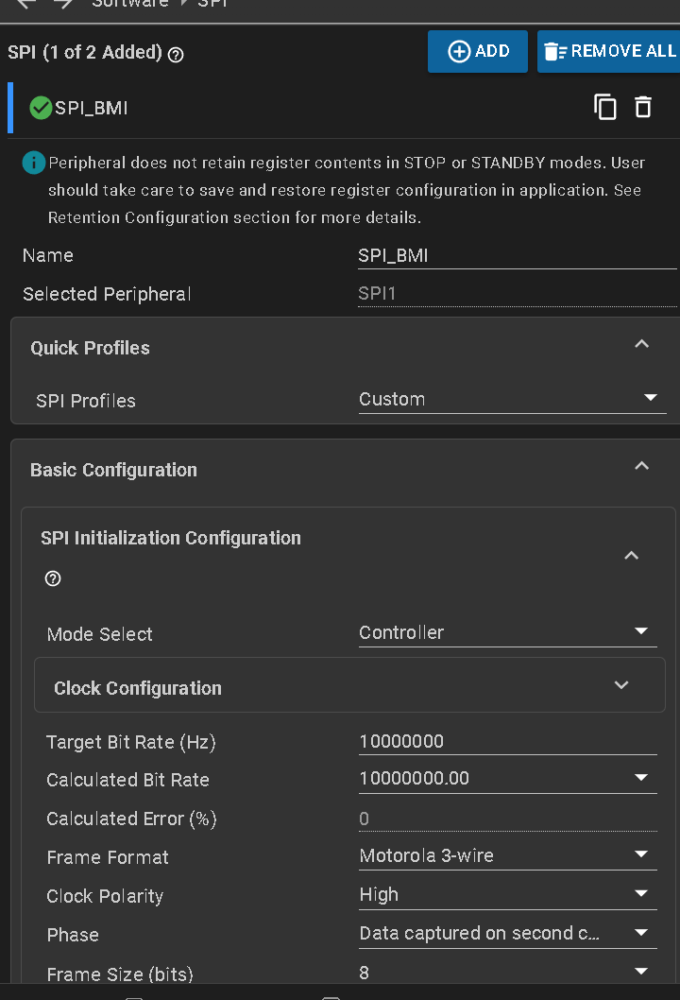
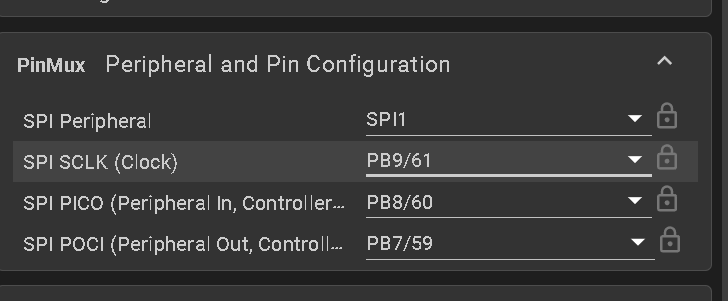

# BMI088配置指南

## 配置






**POCI指的是MISO，PICO是MOSI.......**


## 使用教程

引用：

```
#include "BMI088driver.h"
#include "BMI088reg.h"
#include "BMI088Middleware.h"
```

初始化调用：

```
Ekf_yaw_Forecast();
```

任务中调用：

```
Yaw_Task();	
```

即可(推荐1ms一次)。

显示：

```
extern float yaw_deg;
extern float gyro[3], accel[3], temp;

OLED_Printf(0,0,8,"Yaw:%.2f ",yaw_deg);
OLED_Printf(0,0,8,"Gx:%.2f Gy:%.2f ",gyro[0],gyro[1]);
OLED_Printf(0,0,8,"Gz:%.2f Ax:%.2f ",gyro[2],accel[0]);
OLED_Printf(0,0,8,"Ay:%.2f Az:%.2f",accel[1],accel[2]);
OLED_Refresh();
```


