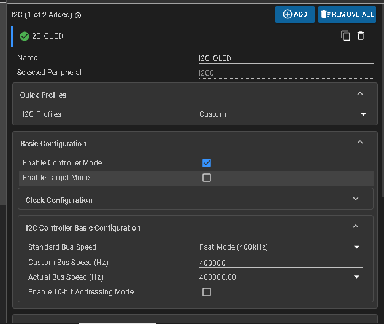
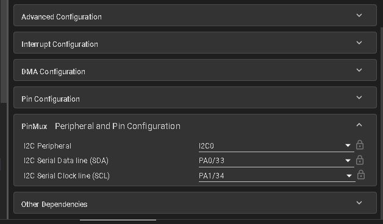
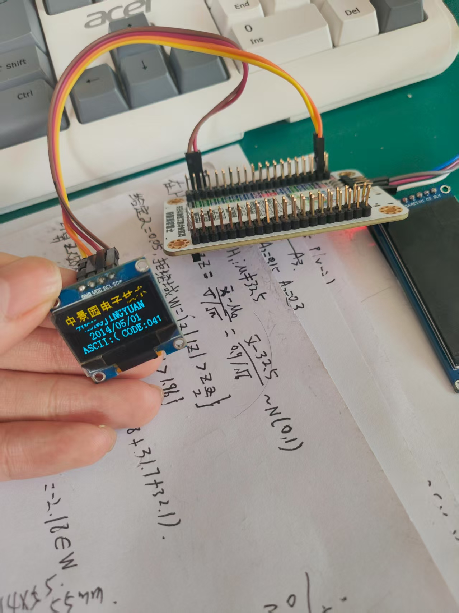
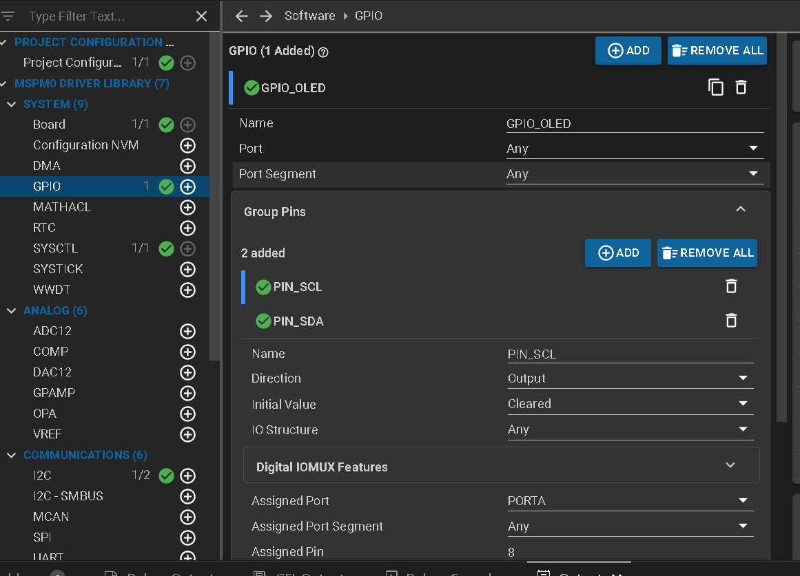
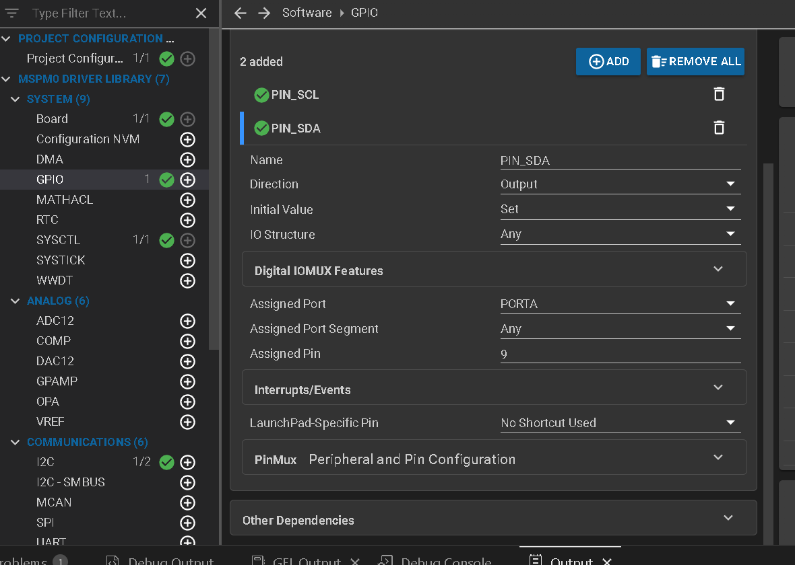

# 分为硬件I2C和软件I2C

## 硬件I2C：





具体文件为hw_oled.c.h，bmp.h，oledfont.h

使用方法：

```
int main(void)
{
    SYSCFG_DL_init();

    uint8_t t=' ';

    OLED_Init();
    OLED_DisPlay_On();
    while (1) 
    {
        OLED_ShowChinese(0,0,0,16,1);//中
        OLED_ShowChinese(18,0,1,16,1);//景
        OLED_ShowChinese(36,0,2,16,1);//园
        OLED_ShowChinese(54,0,3,16,1);//电
        OLED_ShowChinese(72,0,4,16,1);//子
        OLED_ShowChinese(90,0,5,16,1);//科
        OLED_ShowChinese(108,0,6,16,1);//技
        OLED_ShowString(8,16,(uint8_t *)"ZHONGJINGYUAN",16,1);
        OLED_ShowString(20,32,(uint8_t *)"2014/05/01",16,1);
        OLED_ShowString(0,48,(uint8_t *)"ASCII:",16,1);  
        OLED_ShowString(63,48,(uint8_t *)"CODE:",16,1);
        OLED_ShowChar(48,48,t,16,1);
        t++;
        if(t>'~')t=' ';
        OLED_ShowNum(103,48,t,3,16,1);
        OLED_Refresh();
        delay_cycles(CPUCLK_FREQ / 1000 * 500);
        OLED_Clear();
    }
}
```



## 软件I2C





具体文件为oled_software_i2c.c.h，bmp.h，oledfont.h

用法跟硬件一样，函数名和参数都一样。不过速度很慢，毕竟主频默认32M，最高40M

```
int main(void)
{
    SYSCFG_DL_init();

    uint8_t t=' ';

    OLED_Init();
    OLED_DisPlay_On();
    while (1) 
    {
        OLED_ShowChinese(0,0,0,16,1);//中
        OLED_ShowChinese(18,0,1,16,1);//景
        OLED_ShowChinese(36,0,2,16,1);//园
        OLED_ShowChinese(54,0,3,16,1);//电
        OLED_ShowChinese(72,0,4,16,1);//子
        OLED_ShowChinese(90,0,5,16,1);//科
        OLED_ShowChinese(108,0,6,16,1);//技
        OLED_ShowString(8,16,(uint8_t *)"ZHONGJINGYUAN",16,1);
        OLED_ShowString(20,32,(uint8_t *)"2014/05/01",16,1);
        OLED_ShowString(0,48,(uint8_t *)"ASCII:",16,1);  
        OLED_ShowString(63,48,(uint8_t *)"CODE:",16,1);
        OLED_ShowChar(48,48,t,16,1);
        t++;
        if(t>'~')t=' ';
        OLED_ShowNum(103,48,t,3,16,1);
        OLED_Refresh();
        delay_cycles(CPUCLK_FREQ / 1000 * 500);
        OLED_Clear();
    }
}
```

