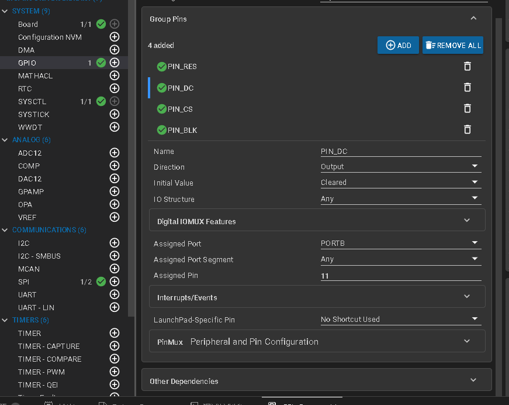

# 1.9寸ST7789屏幕

## 配置GPIO,四个引脚





## SPI配置


使用方法：

```
#include "ti/driverlib/m0p/dl_core.h"
#include "ti_msp_dl_config.h"
#include "hw_lcd.h"
#include "stdarg.h"
#include "stdio.h"

int lcdSprintf(unsigned int x,unsigned int y,unsigned int fc,unsigned int bc,unsigned char sizey,unsigned char mode,char *format, ...)
{
    char buffer[320];
    va_list arg;
    int len;

    va_start(arg, format);
    len = vsnprintf(buffer, sizeof(buffer), format, arg);
    va_end(arg);

    // 计算最大显示宽度（假设最多显示10个字符，宽度为 sizey/2）
    int max_chars = 10; // 你可以根据实际最大长度调整
    int sizex = sizey / 2;
    int area_width = max_chars * sizex;
    int area_height = sizey;

    // 先用背景色清空显示区域
    LCD_Fill(x, y, x + area_width, y + area_height, bc);

    LCD_ShowString(x, y, (unsigned char *)buffer, fc, bc, sizey, mode);
    return len;  
}

int main(void)
{
    SYSCFG_DL_init();
    lcd_init();
    
    //  关闭背光
    LCD_BLK_Clr();
    //显示全屏背景颜色
    LCD_Fill(0,0,LCD_W,LCD_H,BLACK);
    
    // //打开背光
	LCD_BLK_Set();
    int i = 0;
    while (1) {
        LCD_ShowString(0,3,"123",WHITE,BLACK,24,0);
        LCD_ShowChinese(0,26,(unsigned char *)"中",WHITE,BLACK,32,1);
        // LCD_ShowIntNum(0, 52, i, sizeof(i), WHITE, BLACK, 24);
        lcdSprintf(0, 52, WHITE, BLACK, 24, 1, "I=%d ",i);
        i++;
        delay_cycles(CPUCLK_FREQ);
    }
}
```

