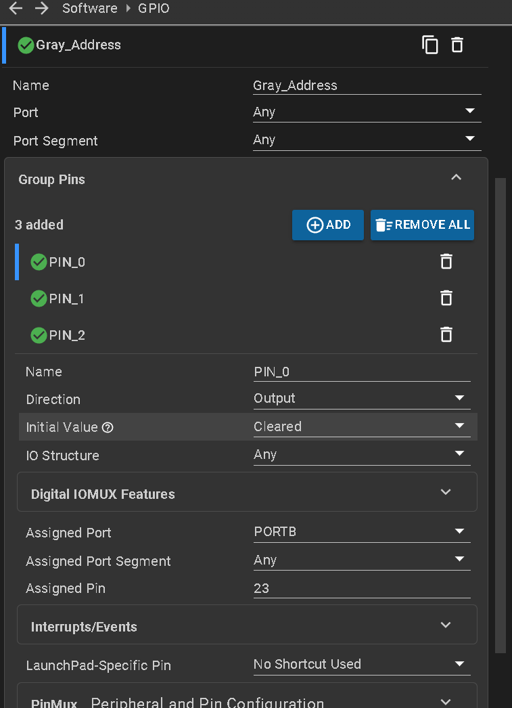
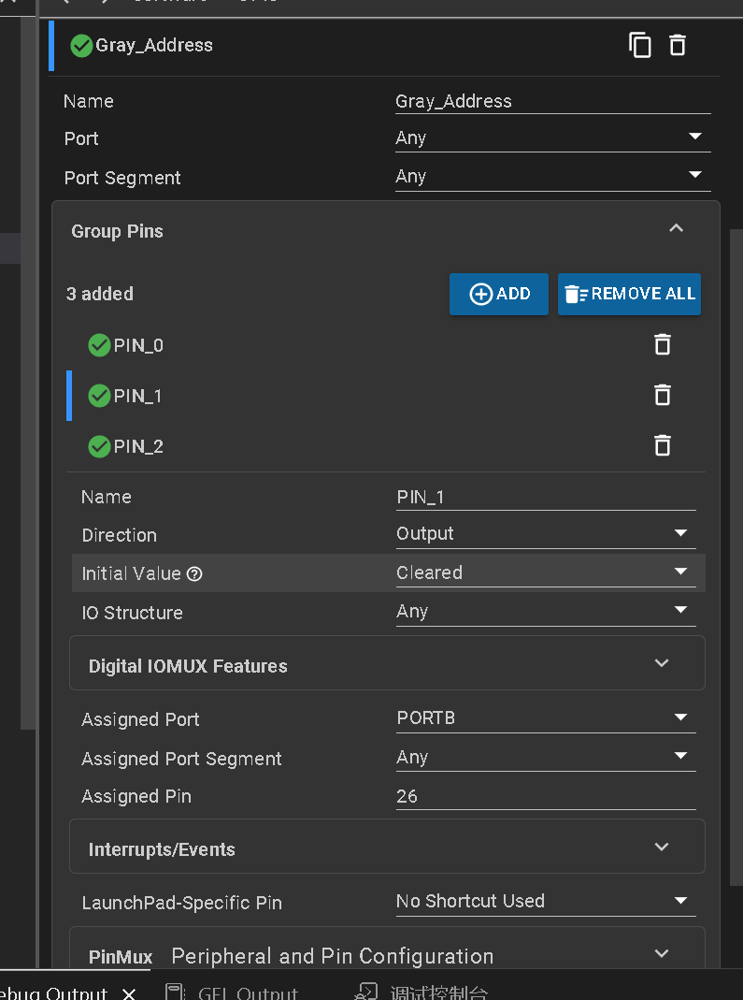
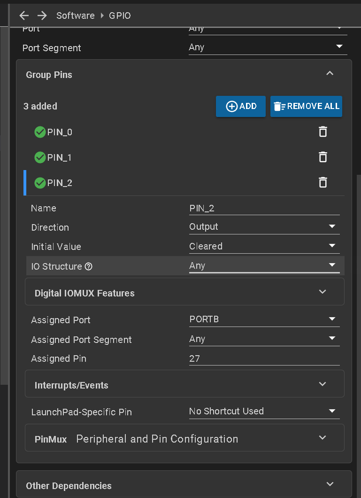
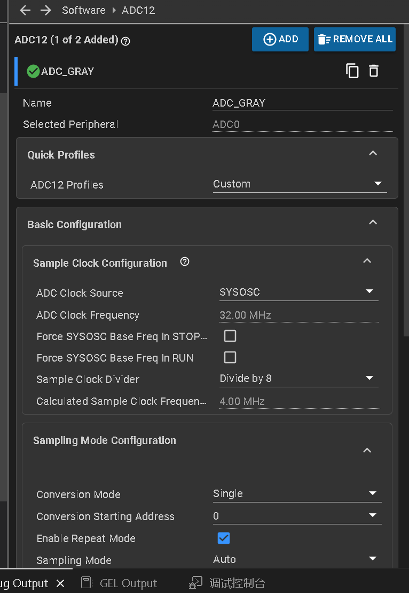
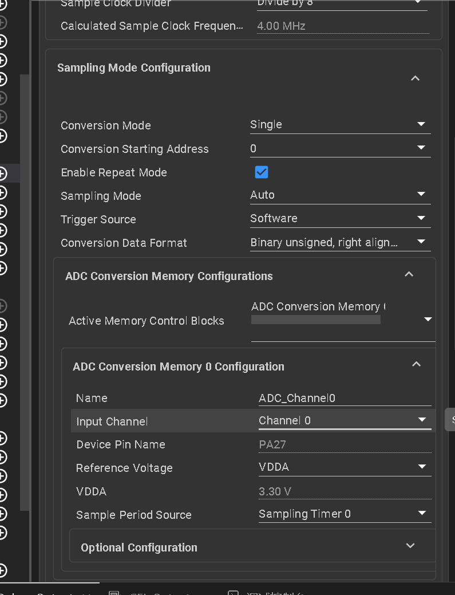
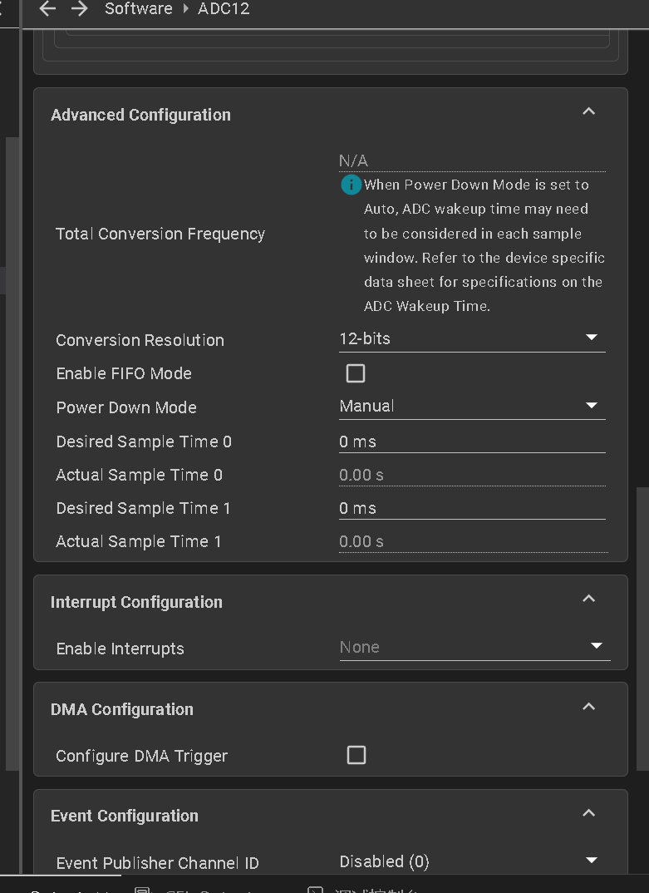
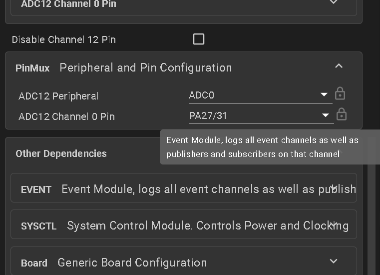
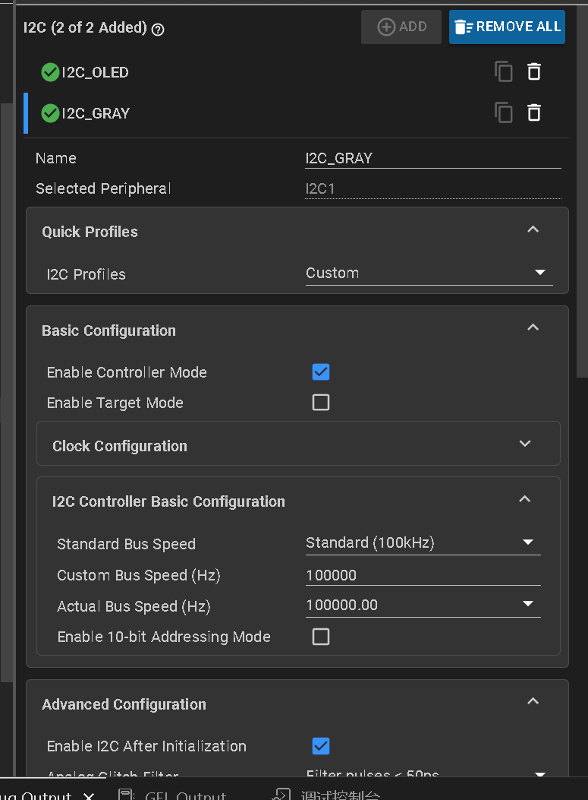

# 感为八路灰度

## 无MCU版本

驱动代码为:No_Mcu_gray.c.h和ADC文件下的内容

### 配置















### 使用

初始化

```
no_gray_init_all();
```

任务

```
no_gray_work();
```

我这边15ms周期执行

显示

```
extern uint8_t black_line_count;
extern unsigned char Digtal;

OLED_Printf(0,48,8,"Gary %d%d%d%d%d%d%d%d L%d",(Digtal>>0)&0x01,(Digtal>>1)&0x01,(Digtal>>2)&0x01,(Digtal>>3)&0x01,(Digtal>>4)&0x01,(Digtal>>5)&0x01,(Digtal>>6)&0x01,(Digtal>>7)&0x01,black_line_count);	


```


如何按键校准？

在no_gray_init_all()里有这么一句

```
Get_Anolog_Value(&sensor,Anolog);
	//此时打印的ADC的值，可用通过这个ADC作为黑白值的校准
	//也可以自己写按键逻辑完成一键校准功能
```

也就是说Anolog[8]是那个阈值，所以直接

简略版本：

```
extern unsigned short Anolog[8];
extern unsigned short white[8];
extern unsigned short black[8];

OLED_Printf(0,0,8,"gray adjust mode");
no_gray_adjust();
OLED_Printf(0,16,8,"Anolog:%d ",Anolog[0]);
OLED_Refresh();
if(KeyNum == 1)
{
    KeyNum = 0;
    for(uint8_t i=0;i<8;i++)
    {
        white[i] = Anolog[i];
    }
    OLED_Printf(0,32,8,"white %d ",white[0]);	
    OLED_Refresh();
}
else if(KeyNum == 2)
{
    KeyNum = 0;
    for(uint8_t i=0;i<8;i++)
    {
        black[i] = Anolog[i];
    }
    OLED_Printf(0,48,8,"black %d ",black[0]);	
    OLED_Refresh();
}
else if(KeyNum == 4)
{
    KeyNum = 0;
    menu_select = 0;
    adjust_mode = 0;
}

OLED_Printf(64,32,8,"uwTick:%d   ",uwTick);
```


## 含MCU版本

除了no_gray那两个文件，其他都是。

配置I2C



其他没什么

### 使用流程：

直接任务里调用

```
Gray_Task();
```

即可

显示：

```
OLED_Printf(0,48,8,"Gary:%d%d%d%d%d%d%d%d L%d",(Digtal>>0)&0x01,(Digtal>>1)&0x01,(Digtal>>2)&0x01,(Digtal>>3)&0x01,(Digtal>>4)&0x01,(Digtal>>5)&0x01,(Digtal>>6)&0x01,(Digtal>>7)&0x01,black_line_count);

```

