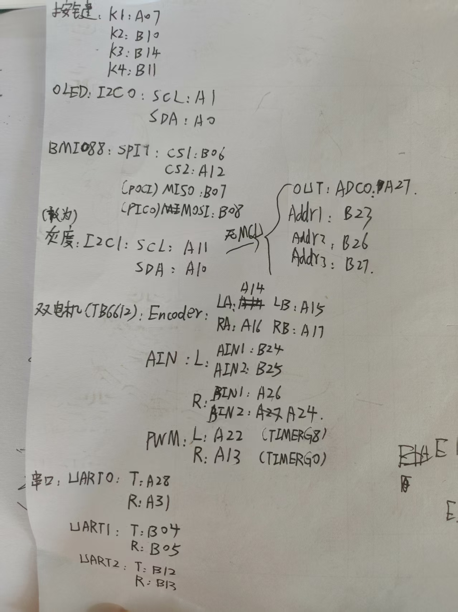

# M0小车

现在采用的是感为八路循迹，~~稍后更改~~。已更改

引脚A11 - A10(I2C1)闲置，新增OUT -- A27(ADC0)。Addr1 -- B23。Addr2 -- B26。Addr3 -- B27。

更改电机BIN2的引脚为A24 (原A27) 。

目前任务里放了一个巡线任务line3_loop_update(1.5f,1.5f);单位圈/s。

所有任务均放在system.c里，内含一个uwTick至关重要，其他任务自行仿照添加即可。

三环PID

Keil版本更新落后，有需要的直接复制BSP代码，然后复制CCS的sysconfig重新覆盖添加即可，M0仅支持V6版本，但是keil V6版本有个报错**__packed报错**。这个尚未解决。

**M0的PA18不要接！！！！**，接了锁芯片

芯片解锁方法看另一个https://blog.csdn.net/qq_63466036/article/details/140636260

# 接线图：

