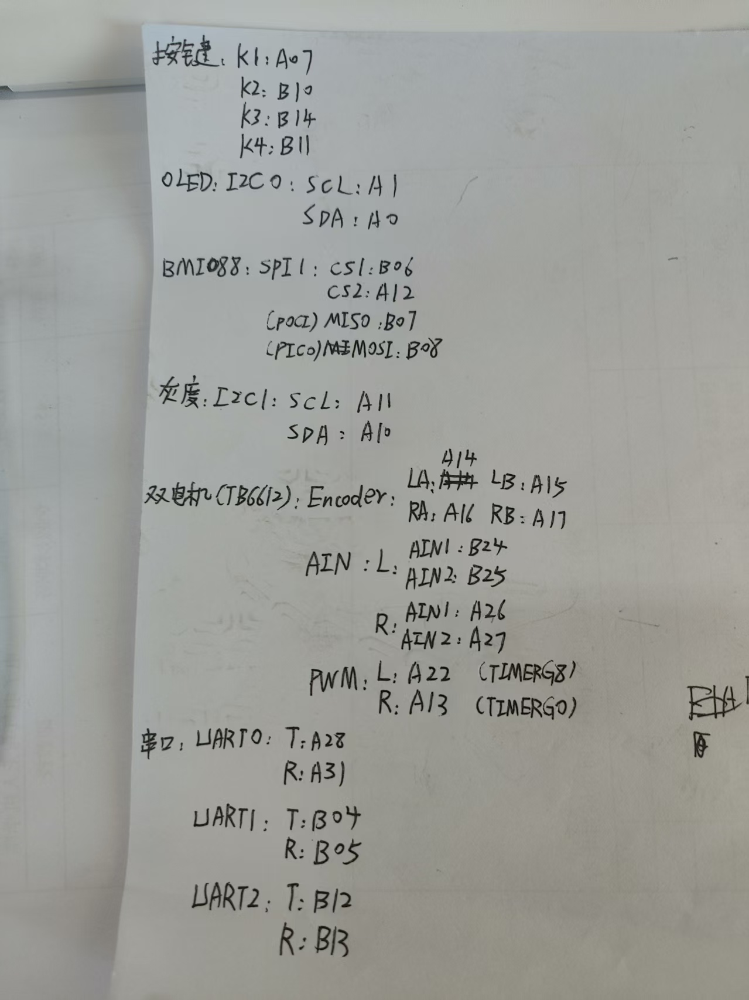

# M0小车

现在采用的是感为八路循迹，稍后更改

目前任务里放了一个巡线任务line3_loop_update(1.5f,1.5f);单位m/s。

所有任务均放在system.c里

目前PID没有适配好

Keil版本稍后更新，M0仅支持V6版本，V6版本有个报错**__packed报错**。这个尚未解决

**M0的PA18不要接！！！！**，接了锁芯片

芯片解锁方法看另一个https://blog.csdn.net/qq_63466036/article/details/140636260

# 接线图：

