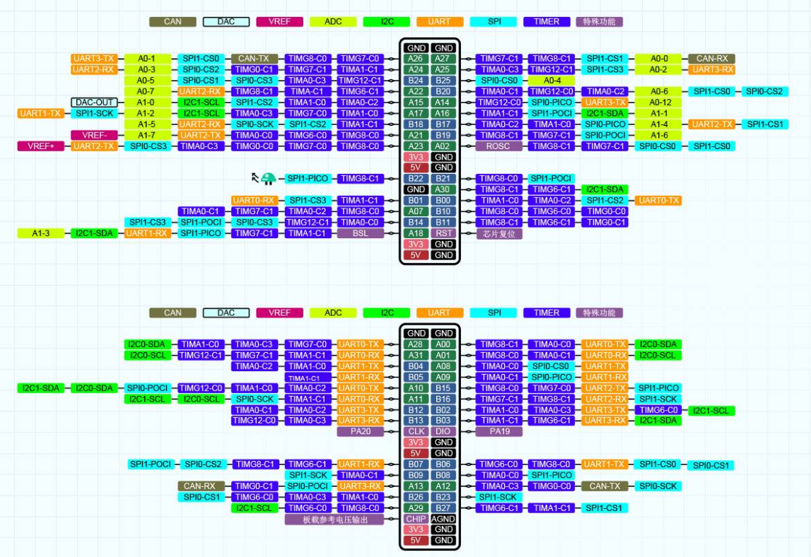

# TI板 模块移植全攻略

更新中........

基于[【立创·天猛星MSPM0G3507开发板】介绍 | 立创开发板技术文档中心](https://wiki.lckfb.com/zh-hans/tmx-mspm0g3507/)

本项目主要重点在于模块的移植，想详细了解原理可以看立创开发指南。

其他侧重点有(在API汇总里)：

GPIO控制
I2C读写
SPI读写
us延时/ms延时
UART收发
TIM/PWM设置
TIM/编码器读取

## PS

使用 J-link 烧录，有些 J-link 烧录需要对单片机单独供电，如果遇到无法连接的情况可以试一试。


引脚定义



## 目录如下：

assets为图片文件夹

```
TI_MSP_Tips/
├── 00_环境配置/                # 环境搭建与配置相关文档
│   ├── 环境配置指南.md
│   ├── 问题汇总.md
|   ├── 资源包.txt
├── 01_各类API/                # 各类API使用说明
│   ├── API汇总与外设配置.md
├── 02_模块/                   # 各功能模块移植与使用
│   ├── OLED/
│   │   ├── readme.md
│   │   └── 示例代码/
│   ├── ST7789/
│   │   ├── readme.md
│   │   └── 示例代码/
│   ├── BMI088/
│   │   ├── readme.md
│   │   └── 示例代码/
├── 03_M0小车/ 
│   │   ├── README.md
│   │   └── 示例代码/
├── README.md                   # 项目总览与导航
```

